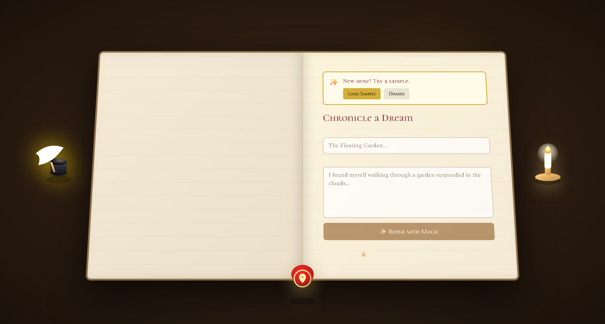
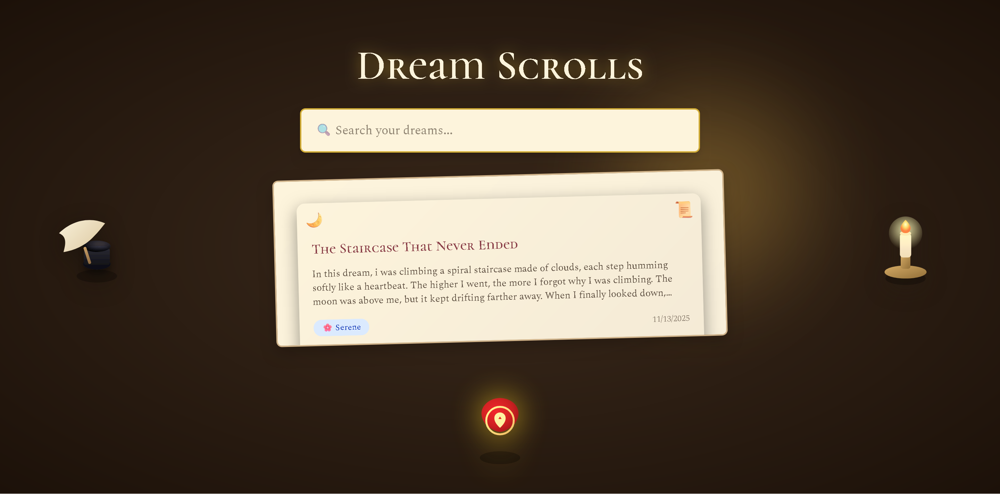
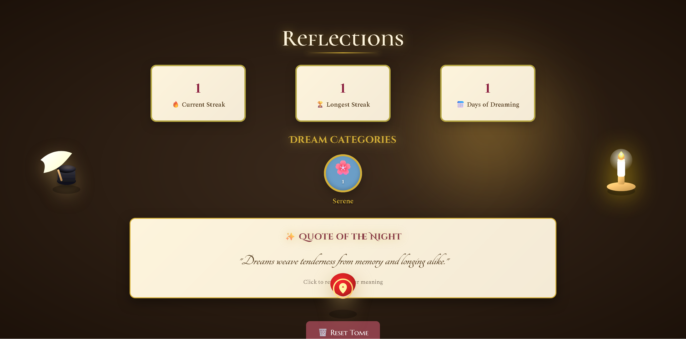

# ✨ DreamTome ✨

<p align="center">
  
</p>

<h3 align="center">Your personal sanctuary for chronicling, exploring, and understanding your dreams.</h3>

<p align="center">
  
  
  
  
</p>

---

DreamTome is a beautifully crafted dream journaling application designed to be your private, offline-first companion for exploring the world of your subconscious. Featuring a unique, storybook-inspired, book-like interface. Every element is crafted to evoke a magical study room experience: wax seals, parchment panels, and flippable dream scrolls.

## 📸 Screenshots
| Tome View | Dream Library | Reflections |
| :---: | :---: | :---: |
|  |  |  |

---

## 🚀 Features
- **✍️ Chronicle Your Dreams:** Elegant book-like journaling interface with AI-powered refinement.
- **✨ "Refine with Magic":** Use AI to transform raw notes into immersive, well-written prose.
- **📜 Dream Library:** Visual stack of dream scrolls, full-text search, flippable dream cards.
- **📊 Reflections & Streaks:** Track journaling streaks, see dream patterns, and receive AI-generated "Quote of the Night."
- **🏷️ Categorization & Tagging:** Auto-categorize (Serene, Strange, Nightmare, Epic) and add custom tags.
- **🔒 Privacy First:** Dreams stored locally only. No data leaves your browser.
- **🖼️ Export:** Save favorite dreams as images for personal use.

---

## 🛠️ Tech Stack
- **Frontend:** React 19
- **Build Tool:** Vite
- **Language:** TypeScript
- **Styling:** Tailwind CSS + Custom parchment CSS
- **Routing:** React Router
- **Image Export:** html2canvas

---

## ⚙️ Technical Overview
DreamTome is not a standard CRUD app. It's handcrafted, animated, and immersive. The UI is skeuomorphic: parchment cards, candles, wax seals, artifacts. Offline local storage model, no external frameworks beyond Tailwind and custom CSS.

---

## 📁 Project Structure
```
src/
  components/
  hooks/
  utils/
  styles/
  types/
  App.tsx
  main.tsx
```

## 🔑 Key Components
- **FlippableDreamCard**: 3D flip animation, AI insight panel, scroll + audio layering
- **DreamCardArtifacts**: Clickable floating artifacts, triggers flip/expand
- **dreamInterpreter.ts**: Emotion detection, symbol extraction, AI interpretation synthesis
- **useDreams.ts**: LocalStorage CRUD logic

---

## 🏁 Getting Started
### Prerequisites
- [Node.js](https://nodejs.org/en/) (v18 or higher)
- [pnpm](https://pnpm.io/) or npm/yarn

### Installation
```sh
git clone https://github.com/harryneopotter/DreamTome.git
cd DreamTome
pnpm install # Or npm install
git checkout main
```

### Running the Application
```sh
pnpm dev # Or npm run dev
```
Open your browser to `http://localhost:5173` (or address shown in your terminal)

---

## 🧪 Testing Checklist
- Flip animations, modal interactions, artifact layering
- LocalStorage persistence, insight scroll

---

## 🗺️ Roadmap
- Dream Tome book UI
- PDF export
- Dream tagging
- AI summaries
- Symbol dictionary
- Night-mode parchment
- Streak calendar

---

## 📄 License
This project is licensed under the MIT License - see the [LICENSE](LICENSE) file for details.

---

<p align="center">Made with ❤️ by the DreamTome team.</p>

---

**Let me know if you'd like any changes or a direct Pull Request!**
